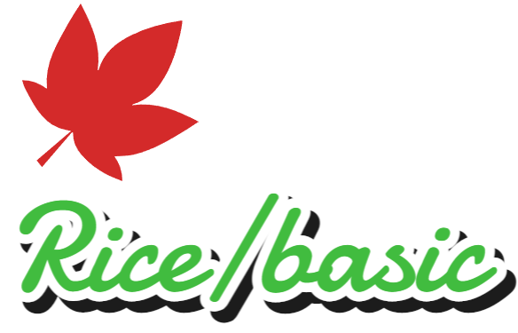
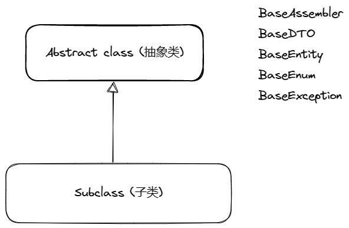
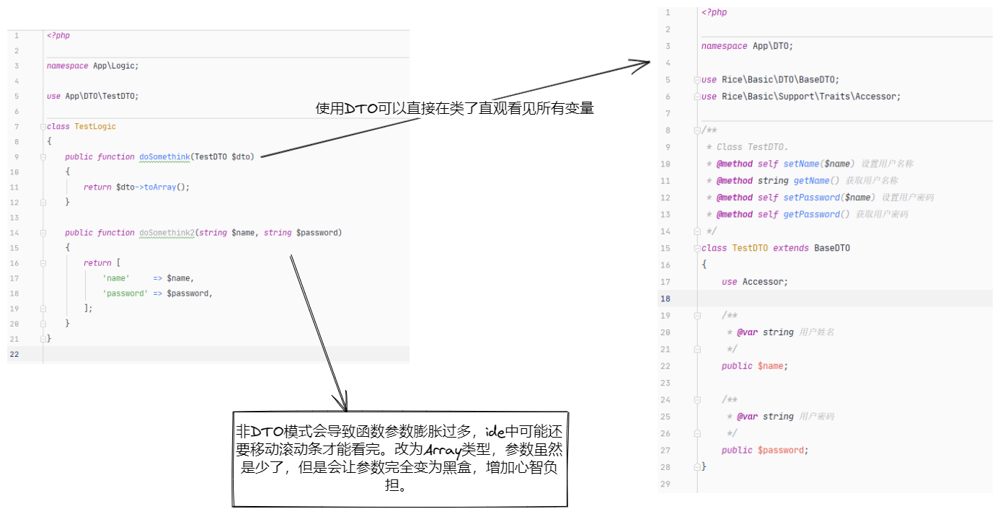

[](https://www.apache.org/licenses/LICENSE-2.0.html)
[]('https://github.com/dmf-code/basic/stargazers')
[]('https://github.com/dmf-code/basic/members')
[](https://github.com/rice-code/basic/actions/workflows/ci.yml)

## php工具包 （php basic tool）


[中文文档](https://rice-code.github.io/zh/)

### 安装

```shell script
composer require rice/basic
```

### 功能点
1. 提供基础框架组件 [锚点](#框架组件)
2. 参数自动填充 [锚点](#请求参数自动数据填充)
3. 请求客户端封装 [锚点](#请求客户端封装)
4. 场景校验 [锚点](#场景校验)

### 使用场景
1. 数组替换为对象进行管理
2. 转换为对象后需要填充属性，可以使用参数自动填充功能
3. 封装字段

### 框架组件
```text
BaseAssembler
BaseDTO
BaseEntity
BaseEnum
BaseException
```



#### Assembler
数据装配器，主要继承 `BaseAssembler` 类。该层主要是统一将 `DTO` 和 `Entity` 相互转换，如果缺少了
装配这一层，大部分代码可能就会落在 `Service` 层里面，而且参数这些会比较多，就会造成函数膨胀起来。代码
整洁的原理就是尽量细分，归类，所以提供装配器接口（面向接口编程而非实现）。

> 可选，代码重构时可做优化，提高代码可读性

```php
<?php

namespace App\Assembler;

use App\DTO\TestDTO;
use Illuminate\Http\Request;

class TestAssembler implements BaseAssembler
{
    public function toDTO(Request $request)
    {
        return (new TestDTO())
            ->setName($request->name)
            ->setPassword($request->password);
    }
}

```

#### DTO
数据传输层对象，主要继承 `BaseDTO` 类。该层主要是聚合业务层中的多个参数变量，保证编写的代码更加整洁，
并且参数变量更加直观。

> 采用失血模型，基本上只做数据传输，不存在业务行为



#### Entity
实体对象目录，主要继承 `BaseEntity` 类，业务逻辑中构建的具体实体模型。继承该抽象类的主体是业务中的
实体对象，主要考验个人对于建模的能力。这里和数据库的模型区别在于，模型是基于数据表进行建模的，实体是
基于业务进行建模的。

> 采用充血模型，提高实体的内聚性

#### Enum
枚举类目录，通常存放 `const` 变量, `ReturnCodeEnum` 类，按照阿里巴巴Java手册（泰山版）进行设计。

```php
class ReturnCodeEnum extends BaseEnum
    implements ClientErrorCode, SystemErrorCode, ServiceErrorCode
{
    /**
     * @default OK
     */
    public const OK = '00000';
}
```
使用该包，默认强制要求使用枚举类进行定义返回码和异常码。这样子做可以使代码更可读，并且国际化的信息也能够
与枚举类配合使用。例如：
```php
    /**
     * @level 一级宏观错误码
     * @zh-CN 用户端错误
     */
    public const CLIENT_ERROR = 'A0001';
```
`@zh-CN` 就是中文的描述,具体的标识可以参考国际化地区码。之前有使用过文件配置的方式进行配置结果发现，
使用起来不方便。需要新建不同地区码文件，而且 `Enum` 类对应相关国际化文件过于分散，导致不直观。现在
使用注解的形式进行捆绑在一起，变量与国际化信息更加聚合。

而且使用自动生成国际化文件可以直接使用 `json` 文件, 相对来说不需要可读性，比使用 `php` 更小。


##### 使用场景
对接第三方接口会存在请求 `uri` ，大多数时候我们可能会直接写在了 `service`
类中。这样子写其实就把该变量耦合到该类中了，会导致如果我要做一个并发请求的
`service` 类的话，那么我要么定义多次 `uri` 路由。要么就直接用 `service::const`
直接从 `service2` 调用 `service1` 的代码。
为了更好的解耦代码，我们就需要使用到 `Enum` 类，因为枚举类只保存数据，而没有
业务行为，所以可以给多个 `service` 进行调用。

> 为变量调用，提供解耦

#### Exception
异常类目录, 与 `Enum` 类配合使用。按照功能模块等进行类的细化，做到单一责任。这样
可以更好的在异常抛出后做出不同的兜底措施。

推荐将所有异常相关的抛出都封装到该类进行抛出使用，方便统一管理异常。
```php
<?php

namespace Rice\Basic\Components\Exception;

use Rice\Basic\Components\Enum\BaseEnum;
use Rice\Basic\Components\Enum\HttpStatusCodeEnum;
use Rice\Basic\Components\Enum\InvalidRequestEnum;

class InvalidRequestException extends BaseException
{
    public static function httpStatusCode(): int
    {
        return HttpStatusCodeEnum::INVALID_REQUEST;
    }

    public static function enumClass(): string
    {
        return InvalidRequestEnum::class;
    }

    /**
     * @throws InvalidRequestException
     */
    public static function default(): void
    {
        throw new self(InvalidRequestEnum::DEFAULT);
    }

    /**
     * 如果这里是控制器的话，我们只要维护好 `phpstorm` 自带注释，那在做注解自动获取异常返回时
     * 我们就能为 openApi 生成一个异常返回
     *
     * @throws InvalidRequestException
     */
    public static function InvalidParam(): void
    {
        throw new self(BaseEnum::INVALID_PARAM);
    }
}
```


#### phpunit 配置
添加测试用例，保证源代码流程跑通，修改后的代码主流程不会报错。

### 样例

#### 字段封装
在类里面使用 `use Accessor` 对类的字段属性进行封装，之前设置为
`public` 权限的全部改为 `protected` 或 `private`。
当属性为对象时，`getter` 会获取其克隆对象。这样子做是为了避免对象
暴漏出去后，不小心修改值，导致破坏内部封装，增加心智负担。

> `Accessor` 类默认 `setter`, `getter` 都启用，如果只需要 `setter`
> 或者 `getter` 的话，可以再 `use Setter` 或 `use Getter`

##### bad
```php
$cat->speak;
```

##### better
```php
$cat->getSpeak();
$cat->setSpeak($val);
```

> 面向对象三大特性之一封装，即隐藏对象内部数据的能力。如果都是公共属性的话，
> 就会造成该对象没有任何限制的进行获取和修改属性数据，导致后续维护变得复杂。

#### 注解使用

```php
class Cat
{
    use AutoFillProperties;

    /**
     * @var string
     */
    public $eyes;

    /**
     * @var Eat
     */
    public $eat;

    /**
     * @var Speak
     */
    public $speak;

    /**
     * @var string[]
     */
    public $hair;
}
```

##### php8 支持使用内置注解

```php
class Cat
{
    use AutoFillProperties;

    #[Doc(var: 'Eye[]', text: '眼睛')]
    public $eyes;

    #[Doc(var: 'Eat')]
    public $eat;

    #[Doc(var: 'Speak')]
    public $speak;

    #[Doc(var: 'string[]')]
    public $hair;
}
```


引入 `AutoFillProperties` 类,然后使用 `@var` 进行编写注解，第一个参数是变量类型，第二个就是注释。这里面
实现原理是使用类反射获取到相关注释的内容，正则进行匹配相关的值。最后判断这个类型是系统类型还是自定义类，是类的
话就需要读取文件的命名空间，获取到相关对象的命名空间，从而实例化对象。这里面提供了缓存，因为类的改动只会在编写
时经常变动。

#### 请求参数自动数据填充
`Laravel` 和 `Tp` 框架现在都支持自定义 `Request` 对象，所以这里我们可以定义所有的入参对象。然后使用 `basic`
 包的 `AutoFillProperties` 类就能实现参数自动填充到 `Request` 对象的类属性中去了。

`trait` `AutoFillProperties` 已使用类属性,使用该类必须避免重写问题。

`src/Entity/FrameEntity.php`: 

```php
    private static array $_filter = [
        '_setter',
        '_getter',
        '_readOnly',
        '_params',
        '_properties',
        '_alias',
        '_cache',
        '_idx',
    ];
```

`Laravel` 例子：

```php
<?php
namespace App\Http\Requests;

use Illuminate\Foundation\Http\FormRequest;
use Rice\Basic\Support\Traits\Accessor;
use Rice\Basic\Support\Traits\AutoFillProperties;

class BaseRequest extends FormRequest
{
    use AutoFillProperties, Accessor;

    /**
     * Determine if the user is authorized to make this request.
     *
     * @return bool
     */
    public function authorize()
    {
        return false;
    }

    /**
     * Get the validation rules that apply to the request.
     *
     * @return array
     */
    public function rules()
    {
        return [
            //
        ];
    }
}
```

```php
<?php

namespace App\Http\Requests;

class TestRequest extends BaseRequest
{
    use AutoFillProperties;
    
    /**
     * @var string 姓名
     */
    protected $name;

    /**
     * @var string 密码
     */
    protected $password;
}
```

```php
<?php

namespace App\Http\Controllers;

use App\Logic\TestLogic;
use Illuminate\Http\Request;
use App\Assembler\TestAssembler;
use App\Http\Requests\TestRequest;
use Illuminate\Support\Facades\Response;

class TestController extends BaseController
{
    public function test(Request $request): \Illuminate\Http\JsonResponse
    {
        $testRequest = new TestRequest($request->all());
        $testRequest->check();
        $testLogic = (new TestLogic());
        
        $dto  = TestAssembler::toDTO($request);
        $resp = $testLogic->doSomethink($dto);

        return Response::json($resp);
    }
}
```

这里面实例化 `TestRequest` 需要将全部参数作为参数，然后请求的参数命名默认采用需要采用蛇形，因为前端大部分是
蛇形命名规范。这里面默认会转为驼峰进行匹配 `TestRequest` 变量进行赋值。

> Request 对象相当于是一个防腐层一样，一个业务中会存在展示，修改，删除等功能。每一部分参数都有些许不一致，但
> 是不可能给增删改查单独写一个 Request 类，不然编码上面太多类了。

#### 请求客户端封装
`GuzzleClient` 包通用逻辑封装

`Support/Abstracts/Guzzle/GuzzleClient.php`

在 `GuzzleClient` 之上再抽离一个匹配对应框架的客户端 `LaravelClient`
`Support/Abstracts/Guzzle/LaravelClient.php`

因为 `GuzzleClient` 需要实例化的日志对象，所以需要适配不同的框架，可以类似
`LaravelClient` 实现。

```php
abstract class LaravelClient extends GuzzleClient
{
    public static function build()
    {
        return new static(LaravelLog::build());
    }
}
```

> 具体的日志实现可参考 `Support/Loggers/LaravelLog.php`

##### 使用场景
该 `client` 只是对 `Guzzle` 包的业务封装，所以使用上与 `Guzzle` 无异。
比如我们可以使用 `$this->options` 提前设置通用属性。`setCallback`函数
必须要实现，这个是判断请求在业务上是否成功的标识。与 `isSuccess` 函数配套使用，
这样子就能把重复的逻辑抽象出来，只处理变化的部分。

```php
class DouYinClient extends LaravelClient
{
    // 通用初始化，可调用基类的 options 属性等
    public function init(): void
    {
         $this->options[RequestOptions::JSON] = [
            'app_id' => DouYinEnum::APP_ID,
            'secret' => DouYinEnum::SECRET,
            'auth_code' => DouYinEnum::AUTH_CODE,
        ];
    }

    /**
     * @throws GuzzleException
     * @throws ClientException
     */
    public function accessToken()
    {
        if ($accessToken = Redis::get(DouYinEnum::CACHE_KEY)) {
            return json_decode($accessToken, true);
        }

        $url = DouYinEnum::DOMAIN_URL.DouYinEnum::ACCESS_TOKEN_URL;

        $this->mergeOption(
            RequestOptions::JSON,
            [
            'grant_type' => DouYinEnum::getGrantType(DouYinEnum::ACCESS_TOKEN_URL)
            ]
        );

        return $this->handle($url);
    }

    /**
     * @throws GuzzleException
     * @throws ClientException|JsonException
     */
    public function refreshToken($refreshToken): array
    {
        $url = DouYinEnum::DOMAIN_URL.DouYinEnum::REFRESH_TOKEN_URL;

        $time = time();

        $this->mergeOption(
            RequestOptions::JSON,
            [
                'grant_type' => DouYinEnum::getGrantType(DouYinEnum::REFRESH_TOKEN_URL),
                'refresh_token' => $refreshToken,
            ]
        );

        $data = $this->handle($url);

        $data['time'] = $time;
        Redis::set(DouYinEnum::CACHE_KEY, json_encode($data, JSON_UNESCAPED_UNICODE));
        return $data;
    }

    /**
     * @param string $url
     * @return array
     * @throws ClientException
     * @throws GuzzleException
     */
    private function handle(string $url): array
    {
        $this->setCallback(function (?ResponseInterface $response) {
            if (!$response) {
                return false;
            }

            $res = json_decode($response->getBody(), true);
            return $res['code'] === 0;
        });

        $res = $this->client->post($url, $this->options);

        if (!$this->isSuccess()) {
            throw new ClientException('请求失败');
        }
        return json_decode($res, true)['data'];
    }
}
```

> tip: 请求的逻辑都要在该client类中实现，比如我有获取token和刷新token的请求，
> 那么全部逻辑应该集中到该 `DouYinClient` 类中。这样子做业务上更加内聚，影响
> 范围不会扩散。

#### 场景校验

支持 `Laravel` 自定义 `Request` 使用场景校验规则，只要引入 `Scene` `traits` 类。
自动使用控制器的方法名称作为场景 `key` 进行注入。未定义相关场景 `key` 则按照 `rules`
定义执行全部规则校验。

```php
<?php

namespace App\Http\Requests;

use Illuminate\Foundation\Http\FormRequest;
use Rice\Basic\Support\Traits\Scene;

class SceneRequest extends FormRequest
{
    use Scene;
    /**
     * Determine if the user is authorized to make this request.
     *
     * @return bool
     */
    public function authorize()
    {
        return true;
    }

    /**
     * Get the validation rules that apply to the request.
     *
     * @return array
     */
    public function rules()
    {
        return [
            'state' => 'required|max:1',
            'auth_code' => 'required|max:2'
        ];
    }

    public function scenes()
    {
        return [
            'callback' => []
        ];
    }
}

```

### 配套工具

> 配合工具包使用更佳

#### rice/ctl

1. setting, getting 注释生成命令 [锚点](https://github.com/rice-code/ctl#%E8%AE%BF%E9%97%AE%E5%99%A8%E8%87%AA%E5%8A%A8%E7%94%9F%E6%88%90%E6%B3%A8%E9%87%8A)
2. json 转 class 对象命令 [锚点](https://github.com/rice-code/ctl#json-%E8%BD%AC-class-%E5%AF%B9%E8%B1%A1)
3. 多语言国际化（i18n） [锚点](https://github.com/rice-code/ctl#i18n-缓存生成)

```shell script
composer require rice/ctl
```


### 相关链接

[创建属于自己的 composer 包](https://dmf-code.github.io/posts/54650cde2a44/)

[国际化地区码](./doc/国际化地区码.md)

[阿里巴巴Java手册（泰山版）](https://developer.aliyun.com/article/766288)

## Star History

[](https://star-history.com/#dmf-code/basic&Date)


### 感谢 JetBrains 赞助


[免费许可证计划](https://www.jetbrains.com.cn/community/opensource/#support)
