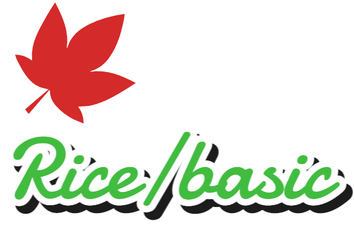
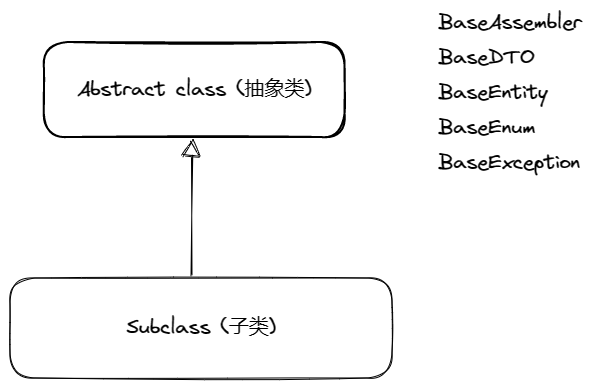

[](https://www.apache.org/licenses/LICENSE-2.0.html)
[]('https://github.com/dmf-code/basic/stargazers')
[]('https://github.com/dmf-code/basic/members')
[](https://github.com/rice-code/basic/actions/workflows/ci.yml)
[](https://github.com/rice-code/basic/actions/workflows/tests.yml)

# Rice Basic

一个功能完善、结构清晰的 PHP 基础工具包，提供了丰富的组件和工具类，帮助开发者快速构建高质量的 PHP 应用。

## 特性

- **基础框架组件**：提供 DTO、Entity、Enum、Exception 等核心组件
- **参数自动填充**：简化对象属性赋值，提高开发效率
- **数据访问与转换**：提供强大的类型转换和数据提取工具
- **日志系统**：支持带追踪ID的日志记录和多环境适配
- **异常处理**：完善的异常体系和观察者模式实现
- **国际化支持**：内置多语言处理能力
- **单例模式**：线程安全的单例实现
- **性能优化**：包含性能监控和优化工具
- **契约式编程**：定义清晰的接口规范

## 安装

```shell script
composer require rice/basic
```

## 目录结构

```text
├── src/
│   ├── Components/       # 核心组件
│   │   ├── Assembler/    # 数据装配器
│   │   ├── DTO/          # 数据传输对象
│   │   ├── Entity/       # 业务实体
│   │   ├── Enum/         # 枚举类
│   │   ├── Exception/    # 异常类
│   │   └── VO/           # 值对象
│   ├── Contracts/        # 接口定义
│   └── Support/          # 支持工具类
│       ├── Abstracts/    # 抽象类
│       ├── Annotation/   # 注解处理
│       ├── Converts/     # 转换器
│       ├── Loggers/      # 日志实现
│       ├── Observers/    # 观察者
│       ├── Properties/   # 属性处理
│       ├── Traits/       # 特性集合
│       └── Utils/        # 工具函数
├── tests/                # 测试代码
├── doc/                  # 文档
└── storage/              # 存储目录
    └── logs/             # 日志文件
```

## 核心组件

### 框架组件关系



### DTO (数据传输对象)

数据传输层对象，主要继承 `BaseDTO` 类。用于聚合业务层中的多个参数变量，使代码更加整洁，参数变量更加直观。

**特点**：
- 采用失血模型，主要用于数据传输
- 提供属性访问器和修改器
- 支持参数自动填充

**示例**：

```php
<?php

namespace App\DTO;

use Rice\Basic\Components\DTO\BaseDTO;

class UserDTO extends BaseDTO
{
    /**
     * @var int
     */
    private $id;
    
    /**
     * @var string
     */
    private $name;
    
    /**
     * @var string
     */
    private $email;
}

// 使用示例
$userDTO = new UserDTO();
$userDTO->setId(1)
       ->setName('John Doe')
       ->setEmail('john@example.com');
```

### Entity (实体对象)

业务实体对象，主要继承 `BaseEntity` 类。用于构建业务逻辑中的具体实体模型。

**特点**：
- 采用充血模型，包含业务行为
- 提供属性访问器和修改器
- 支持参数自动填充

**示例**：

```php
<?php

namespace App\Entity;

use Rice\Basic\Components\Entity\BaseEntity;

class UserEntity extends BaseEntity
{
    /**
     * @var int
     */
    private $id;
    
    /**
     * @var string
     */
    private $name;
    
    // 业务方法
    public function changeName(string $newName): void
  
        $this->name = $newName;
        // 触发相关业务逻辑
    }
}
```

### Assembler (数据装配器)

数据装配器，主要继承 `BaseAssembler` 类。用于统一将 `DTO` 和 `Entity` 相互转换。

**特点**：
- 分离数据转换逻辑
- 减少服务层代码复杂度
- 提高代码可读性和可维护性

**示例**：

```php
<?php

namespace App\Assembler;

use App\DTO\UserDTO;
use App\Entity\UserEntity;
use Rice\Basic\Components\Assembler\BaseAssembler;
use Illuminate\Http\Request;

class UserAssembler implements BaseAssembler
{
    public function toDTO(Request $request): UserDTO
    {
        return (new UserDTO())
            ->setName($request->input('name'))
            ->setEmail($request->input('email'));
    }
    
    public function toEntity(UserDTO $dto): UserEntity
    {
        return (new UserEntity())
            ->setName($dto->getName())
            ->setEmail($dto->getEmail());
    }
}
```

### Enum (枚举类)

枚举类，主要继承 `BaseEnum` 类。按照阿里巴巴Java手册（泰山版）进行设计。

**特点**：
- 集中管理常量定义
- 提高代码可读性
- 支持国际化消息配合使用

**示例**：

```php
<?php

namespace App\Enum;

use Rice\Basic\Components\Enum\BaseEnum;

class UserStatusEnum extends BaseEnum
{
    /**
     * @var int 活跃状态
     */
    public const ACTIVE = 1;
    
    /**
     * @var int 禁用状态
     */
    public const DISABLED = 0;
    
    /**
     * 获取状态描述
     */
    public static function getDescription($value): string
    {
        $descriptions = [
            self::ACTIVE => '活跃',
            self::DISABLED => '禁用'
        ];
        
        return $descriptions[$value] ?? '未知';
    }
}
```

## 高级功能

### 参数自动填充

通过 `AutoFillProperties` 特性实现对象属性的自动填充，简化对象初始化过程。

**示例**：

```php
<?php

use Rice\Basic\Support\Traits\AutoFillProperties;

class User {
    use AutoFillProperties;
    
    private $name;
    private $email;
}

// 自动填充属性
$user = new User();
$user->fill([
    'name' => 'John Doe',
    'email' => 'john@example.com'
]);
```

### 单例模式

通过 `Singleton` 特性实现线程安全的单例模式。

**示例**：

```php
<?php

use Rice\Basic\Support\Traits\Singleton;

class Config {
    use Singleton;
    
    private $settings = [];
    
    public function set($key, $value): void
    {
        $this->settings[$key] = $value;
    }
    
    public function get($key, $default = null)
    {
        return $this->settings[$key] ?? $default;
    }
}

// 获取单例实例
$config = Config::getInstance();
$config->set('app_name', 'My Application');
```

### 日志系统

通过 `LogTraceFacade` 实现带追踪ID的日志记录功能。

**示例**：

```php
<?php

use Rice\Basic\Support\LogTraceFacade;

// 记录不同级别的日志
LogTraceFacade::info('User logged in', ['user_id' => 1]);
LogTraceFacade::warning('Failed login attempt', ['ip' => '192.168.1.1']);
LogTraceFacade::error('Database connection failed', ['error' => $e->getMessage()]);
```

### 异常处理

完善的异常体系和观察者模式实现，支持异常的统一处理和日志记录。

**示例**：

```php
<?php

use Rice\Basic\Components\Exception\InvalidRequestException;

// 抛出异常
if (empty($data)) {
    throw new InvalidRequestException('数据不能为空');
}

// 异常观察者会自动记录异常信息
```

## 工具类

### 字符串工具 (StrUtil)

提供字符串处理的常用方法。

### 数组工具 (ArrUtil)

提供数组处理的常用方法。

### 类型转换 (TypeConvert)

提供各种数据类型之间的转换功能。

### 性能监控 (PerfUtil)

提供代码执行性能监控功能。

## 兼容性

- PHP 7.4+ 兼容
- Laravel 框架兼容
- 独立使用兼容

## 测试

```shell script
composer test
```

## 贡献

欢迎提交 Issue 和 Pull Request 来改进这个项目。

## 许可证

本项目使用 Apache 2.0 许可证 - 详见 [LICENSE](LICENSE) 文件。


#### phpunit 配置
添加测试用例，保证源代码流程跑通，修改后的代码主流程不会报错。

### 样例

### 魔术方法管理
`MagicMethodManager` 是一个用于统一管理魔术方法的特性类，提供了对PHP魔术方法的统一处理机制，包括 `__call`、`__callStatic`、`__get` 和 `__set` 等。

该类的主要功能包括：

1. **统一的魔术方法处理机制**：通过 `handleMagicMethod` 方法集中处理各种魔术方法调用
2. **处理器优先级排序**：支持为不同的魔术方法注册多个处理器，并按照优先级顺序调用
3. **父类魔术方法兼容**：当所有处理器都无法处理时，自动尝试调用父类的对应魔术方法
4. **框架兼容性优化**：特别对Laravel等框架提供了更好的集成支持
5. **高度兼容性设计**：移除了严格的参数类型声明，确保在不同PHP版本和框架环境中都能正常工作

#### 使用方式

```php
class MyClass {
    use MagicMethodManager;
    
    // 可选：注册自定义处理器
    public function initializeMagicMethodManager()
    {
        // 注意：这个方法仅为了保持向后兼容性，实际处理逻辑应在registerDefaultHandlers中实现
    }
}
```

#### 字段封装
在类里面使用 `use Accessor` 对类的字段属性进行封装，之前设置为
`public` 权限的全部改为 `protected` 或 `private`。
当属性为对象时，`getter` 会获取其克隆对象。这样子做是为了避免对象
暴漏出去后，不小心修改值，导致破坏内部封装，增加心智负担。

> `Accessor` 类默认 `setter`, `getter` 都启用，如果只需要 `setter`
> 或者 `getter` 的话，可以再 `use Setter` 或 `use Getter`

##### bad
```php
$cat->speak;
```

##### better
```php
$cat->getSpeak();
$cat->setSpeak($val);
```

> 面向对象三大特性之一封装，即隐藏对象内部数据的能力。如果都是公共属性的话，
> 就会造成该对象没有任何限制的进行获取和修改属性数据，导致后续维护变得复杂。

#### 注解使用

```php
class Cat
{
    use AutoFillProperties;

    /**
     * @var string
     */
    public $eyes;

    /**
     * @var Eat
     */
    public $eat;

    /**
     * @var Speak
     */
    public $speak;

    /**
     * @var string[]
     */
    public $hair;
}
```

##### php8 支持使用内置注解

```php
class Cat
{
    use AutoFillProperties;

    #[Doc(var: 'Eye[]', text: '眼睛')]
    public $eyes;

    #[Doc(var: 'Eat')]
    public $eat;

    #[Doc(var: 'Speak')]
    public $speak;

    #[Doc(var: 'string[]')]
    public $hair;
}
```


引入 `AutoFillProperties` 类,然后使用 `@var` 进行编写注解，第一个参数是变量类型，第二个就是注释。这里面
实现原理是使用类反射获取到相关注释的内容，正则进行匹配相关的值。最后判断这个类型是系统类型还是自定义类，是类的
话就需要读取文件的命名空间，获取到相关对象的命名空间，从而实例化对象。这里面提供了缓存，因为类的改动只会在编写
时经常变动。

#### 请求参数自动数据填充
`Laravel` 和 `Tp` 框架现在都支持自定义 `Request` 对象，所以这里我们可以定义所有的入参对象。然后使用 `basic`
 包的 `AutoFillProperties` 类就能实现参数自动填充到 `Request` 对象的类属性中去了。

`trait` `AutoFillProperties` 已使用类属性,使用该类必须避免重写问题。

`src/Entity/FrameEntity.php`: 

```php
    private static array $_filter = [
        '_setter',
        '_getter',
        '_readOnly',
        '_params',
        '_properties',
        '_alias',
        '_cache',
        '_idx',
    ];
```

`Laravel` 例子：

```php
<?php
namespace App\Http\Requests;

use Illuminate\Foundation\Http\FormRequest;
use Rice\Basic\Support\Traits\Accessor;
use Rice\Basic\Support\Traits\AutoFillProperties;

class BaseRequest extends FormRequest
{
    use AutoFillProperties, Accessor;

    /**
     * Determine if the user is authorized to make this request.
     *
     * @return bool
     */
    public function authorize()
    {
        return false;
    }

    /**
     * Get the validation rules that apply to the request.
     *
     * @return array
     */
    public function rules()
    {
        return [
            //
        ];
    }
}
```

```php
<?php

namespace App\Http\Requests;

class TestRequest extends BaseRequest
{
    use AutoFillProperties;
    
    /**
     * @var string 姓名
     */
    protected $name;

    /**
     * @var string 密码
     */
    protected $password;
}
```

```php
<?php

namespace App\Http\Controllers;

use App\Logic\TestLogic;
use Illuminate\Http\Request;
use App\Assembler\TestAssembler;
use App\Http\Requests\TestRequest;
use Illuminate\Support\Facades\Response;

class TestController extends BaseController
{
    public function test(Request $request): \Illuminate\Http\JsonResponse
    {
        $testRequest = new TestRequest($request->all());
        $testRequest->check();
        $testLogic = (new TestLogic());
        
        $dto  = TestAssembler::toDTO($request);
        $resp = $testLogic->doSomethink($dto);

        return Response::json($resp);
    }
}
```

这里面实例化 `TestRequest` 需要将全部参数作为参数，然后请求的参数命名默认采用需要采用蛇形，因为前端大部分是
蛇形命名规范。这里面默认会转为驼峰进行匹配 `TestRequest` 变量进行赋值。

> Request 对象相当于是一个防腐层一样，一个业务中会存在展示，修改，删除等功能。每一部分参数都有些许不一致，但
> 是不可能给增删改查单独写一个 Request 类，不然编码上面太多类了。

#### 请求客户端封装
`GuzzleClient` 包通用逻辑封装

`Support/Abstracts/Guzzle/GuzzleClient.php`

在 `GuzzleClient` 之上再抽离一个匹配对应框架的客户端 `LaravelClient`
`Support/Abstracts/Guzzle/LaravelClient.php`

因为 `GuzzleClient` 需要实例化的日志对象，所以需要适配不同的框架，可以类似
`LaravelClient` 实现。

```php
abstract class LaravelClient extends GuzzleClient
{
    public static function build()
    {
        return new static(LaravelLog::build());
    }
}
```

> 具体的日志实现可参考 `Support/Loggers/LaravelLog.php`

##### 使用场景
该 `client` 只是对 `Guzzle` 包的业务封装，所以使用上与 `Guzzle` 无异。
比如我们可以使用 `$this->options` 提前设置通用属性。`setCallback`函数
必须要实现，这个是判断请求在业务上是否成功的标识。与 `isSuccess` 函数配套使用，
这样子就能把重复的逻辑抽象出来，只处理变化的部分。

```php
class DouYinClient extends LaravelClient
{
    // 通用初始化，可调用基类的 options 属性等
    public function init(): void
    {
         $this->options[RequestOptions::JSON] = [
            'app_id' => DouYinEnum::APP_ID,
            'secret' => DouYinEnum::SECRET,
            'auth_code' => DouYinEnum::AUTH_CODE,
        ];
    }

    /**
     * @throws GuzzleException
     * @throws ClientException
     */
    public function accessToken()
    {
        if ($accessToken = Redis::get(DouYinEnum::CACHE_KEY)) {
            return json_decode($accessToken, true);
        }

        $url = DouYinEnum::DOMAIN_URL.DouYinEnum::ACCESS_TOKEN_URL;

        $this->mergeOption(
            RequestOptions::JSON,
            [
            'grant_type' => DouYinEnum::getGrantType(DouYinEnum::ACCESS_TOKEN_URL)
            ]
        );

        return $this->handle($url);
    }

    /**
     * @throws GuzzleException
     * @throws ClientException|JsonException
     */
    public function refreshToken($refreshToken): array
    {
        $url = DouYinEnum::DOMAIN_URL.DouYinEnum::REFRESH_TOKEN_URL;

        $time = time();

        $this->mergeOption(
            RequestOptions::JSON,
            [
                'grant_type' => DouYinEnum::getGrantType(DouYinEnum::REFRESH_TOKEN_URL),
                'refresh_token' => $refreshToken,
            ]
        );

        $data = $this->handle($url);

        $data['time'] = $time;
        Redis::set(DouYinEnum::CACHE_KEY, json_encode($data, JSON_UNESCAPED_UNICODE));
        return $data;
    }

    /**
     * @param string $url
     * @return array
     * @throws ClientException
     * @throws GuzzleException
     */
    private function handle(string $url): array
    {
        $this->setCallback(function (?ResponseInterface $response) {
            if (!$response) {
                return false;
            }

            $res = json_decode($response->getBody(), true);
            return $res['code'] === 0;
        });

        $res = $this->client->post($url, $this->options);

        if (!$this->isSuccess()) {
            throw new ClientException('请求失败');
        }
        return json_decode($res, true)['data'];
    }
}
```

> tip: 请求的逻辑都要在该client类中实现，比如我有获取token和刷新token的请求，
> 那么全部逻辑应该集中到该 `DouYinClient` 类中。这样子做业务上更加内聚，影响
> 范围不会扩散。

#### 场景校验

支持 `Laravel` 自定义 `Request` 使用场景校验规则，只要引入 `Scene` `traits` 类。
自动使用控制器的方法名称作为场景 `key` 进行注入。未定义相关场景 `key` 则按照 `rules`
定义执行全部规则校验。

```php
<?php

namespace App\Http\Requests;

use Illuminate\Foundation\Http\FormRequest;
use Rice\Basic\Support\Traits\Scene;

class SceneRequest extends FormRequest
{
    use Scene;
    /**
     * Determine if the user is authorized to make this request.
     *
     * @return bool
     */
    public function authorize()
    {
        return true;
    }

    /**
     * Get the validation rules that apply to the request.
     *
     * @return array
     */
    public function rules()
    {
        return [
            'state' => 'required|max:1',
            'auth_code' => 'required|max:2'
        ];
    }

    public function scenes()
    {
        return [
            'callback' => []
        ];
    }
}

```

### 配套工具

> 配合工具包使用更佳

#### rice/ctl

1. setting, getting 注释生成命令 [锚点](https://github.com/rice-code/ctl#%E8%AE%BF%E9%97%AE%E5%99%A8%E8%87%AA%E5%8A%A8%E7%94%9F%E6%88%90%E6%B3%A8%E9%87%8A)
2. json 转 class 对象命令 [锚点](https://github.com/rice-code/ctl#json-%E8%BD%AC-class-%E5%AF%B9%E8%B1%A1)
3. 多语言国际化（i18n） [锚点](https://github.com/rice-code/ctl#i18n-缓存生成)

```shell script
composer require rice/ctl
```


### 相关链接

[创建属于自己的 composer 包](https://dmf-code.github.io/posts/54650cde2a44/)

[国际化地区码](./doc/国际化地区码.md)

[阿里巴巴Java手册（泰山版）](https://developer.aliyun.com/article/766288)

## Star History

[](https://star-history.com/#dmf-code/basic&Date)
